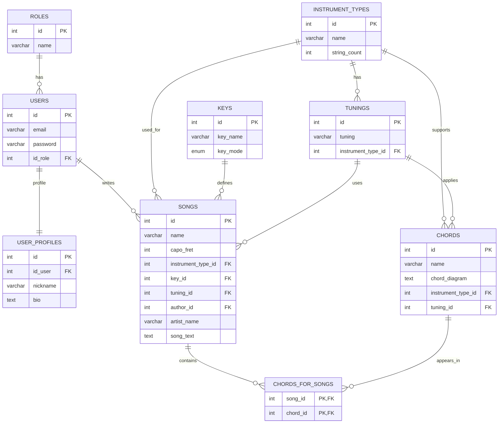

Database scheme:

```mermaid
erDiagram
    ROLES {
        int id PK
        varchar name
    }

    INSTRUMENT_TYPES {
        int id PK
        varchar name
        int string_count
    }

    USERS {
        int id PK
        varchar email
        varchar password
        int id_role FK
    }

    USER_PROFILES {
        int id PK
        int id_user FK
        varchar nickname
        text bio
    }

    KEYS {
        int id PK
        varchar key_name
        enum key_mode
    }

    TUNINGS {
        int id PK
        varchar tuning
        int instrument_type_id FK
    }

    SONGS {
        int id PK
        varchar name
        int capo_fret
        int instrument_type_id FK
        int key_id FK
        int tuning_id FK
        int author_id FK
        varchar artist_name
        text song_text
    }

    CHORDS {
        int id PK
        varchar name
        text chord_diagram
        int instrument_type_id FK
        int tuning_id FK
    }

    CHORDS_FOR_SONGS {
        int song_id PK, FK
        int chord_id PK, FK
    }

    %% Relacje
    ROLES ||--o{ USERS : has
    USERS ||--|| USER_PROFILES : profile
    USERS ||--o{ SONGS : writes

    INSTRUMENT_TYPES ||--o{ SONGS : used_for
    INSTRUMENT_TYPES ||--o{ CHORDS : supports
    INSTRUMENT_TYPES ||--o{ TUNINGS : has

    KEYS ||--o{ SONGS : defines
    TUNINGS ||--o{ SONGS : uses
    TUNINGS ||--o{ CHORDS : applies

    SONGS ||--o{ CHORDS_FOR_SONGS : contains
    CHORDS ||--o{ CHORDS_FOR_SONGS : appears_in


```