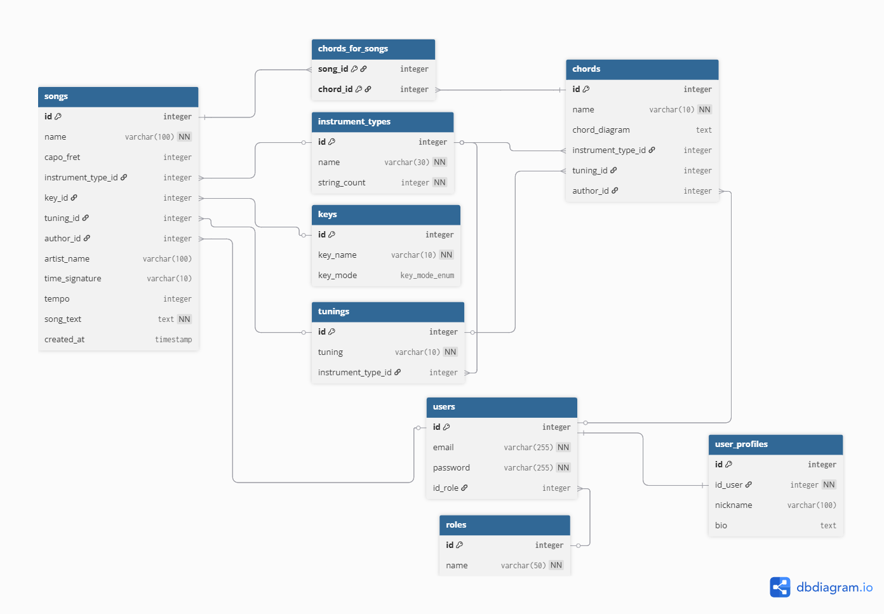

**Chords&Tabs** to aplikacja webowa typu MVC (Model-View-Controller) stworzona dla muzyków. Umożliwia tworzenie, przechowywanie i organizowanie tabulatur oraz akordów gitarowych.

## Instrukcja Uruchomienia

Projekt jest w pełni skonteneryzowany przy użyciu Dockera.

### Wymagania wstępne

* Docker & Docker Compose

### Krok po kroku

1. Sklonuj repozytorium:
```bash
git clone <link-do-twojego-repo>
cd nazwa-katalogu

```


2. Skonfiguruj zmienne środowiskowe:
Stwórz plik `.env` na podstawie przykładu:
```bash
cp .env.example .env

```


*(Upewnij się, że dane w .env pasują do tych w docker-compose.yml)*
3. Uruchom kontenery:
```bash
docker-compose up -d --build

```


4. Aplikacja dostępna jest pod adresem: `http://localhost:8080`

Baza danych zostanie automatycznie zainicjalizowana strukturą i danymi startowymi z pliku `init.sql`.

---

## Architektura i Baza Danych

### Diagram ERD

Poniższy diagram przedstawia strukturę relacyjnej bazy danych PostgreSQL.



### Zastosowane rozwiązania bazodanowe:

* **Widoki (Views):** * `song_details_view` - agreguje dane piosenki, łącząc klucze obce (tonacje, strojenia) w czytelne nazwy.
* `auth_users_view` - bezpieczny widok do procesu logowania.


* **Wyzwalacze (Triggers):**
* `trigger_format_song_data` - automatycznie formatuje nazwy artystów (kapitalizacja) i usuwa białe znaki przed zapisem.


* **Procedury składowane:** Funkcja obsługująca logikę wyzwalacza.
* **Typy danych:** Wykorzystanie `ENUM` dla trybów tonacji (`major`/`minor`).
* **Relacje:** 1:N (Użytkownik-Piosenki) oraz M:N (Piosenki-Akordy).

---

##  Scenariusze Testowe

### Konto użytkownika 
Jeśli chcesz szybko przetestować aplikację bez zakładania nowego konta, skorzystaj z przygotowanych danych logowania:
* **URL:** `http://localhost:8080/login`
* **Email:** `demo@demo.com`
* **Hasło:** `demodemo`
### Konto Administratora

Test weryfikujący podwyższone uprawnienia (dostęp do zasobów globalnych).

* **URL:** `http://localhost:8080/login`
* **Email:** `admin@admin.com`
* **Hasło:** `adminadmin`

**Kroki do wykonania:**
1.  Zaloguj się podanymi danymi.
2.  Przejdź do widoku **Add Chord**.
3.  Sprawdź, czy widoczny jest checkbox **"Add to Global Library"** (powinien być widoczny tylko dla Admina).
4.  Dodaj akord zaznaczając tę opcję.
5.  **Weryfikacja:** Akord ten powinien być widoczny dla wszystkich innych użytkowników w systemie.
**Oczekiwany rezultat:**
Poprawne zalogowanie do panelu głównego z rolą użytkownika (User). Dostęp do biblioteki piosenek oraz możliwość dodawania prywatnych akordów.


### Weryfikacja Bezpieczeństwa (Brak dostępu)

1. Wejdź na stronę główną (niezalogowany).
2. Spróbuj wejść ręcznie na `http://localhost:8080/songs`.
3. **Oczekiwany rezultat:** Automatyczne przekierowanie do panelu logowania.


### CRUD i Wyzwalacze (Trigger)

1. Przejdź do **Songs** -> **Add Song**.
2. Wpisz nazwę artysty małymi literami, np. "the beatles" i dodaj spacje na końcu nazwy utworu.
3. Zapisz piosenkę.
4. **Oczekiwany rezultat:** Piosenka została dodana, a na liście artysta wyświetla się jako "The Beatles" (zadziałał trigger `INITCAP`).


---

## Zrzuty Ekranu Aplikacji
### Biblioteka Piosenek

### Tworzenie Akordów

### Tworzenie Piosenek

### Biblioteka Akordów

### User profile 

---

## Checklist (Realizacja Wymagań)

Poniżej znajduje się lista zrealizowanych punktów wymaganych przez regulamin zaliczenia projektu.

* [x] Dokumentacja w `README.md`
* [x] Architektura aplikacji (Wzorzec MVC)
* [x] Kod napisany obiektowo
* [x] Diagram ERD
* [x] Repozytorium Git (historia commitów, struktura)
* [x] Realizacja tematu projektu
* [x] HTML
* [x] PostgreSQL
* [x] Złożoność bazy danych
* [x] Eksport bazy danych do pliku `.sql` 
* [x] PHP
* [x] JavaScript 
* [x] Fetch API
* [x] Design
* [x] Responsywność
* [x] Logowanie użytkownika
* [x] Sesja użytkownika
* [x] Uprawnienia użytkowników 
* [x] Role użytkowników (Admin, user)
* [x] Wylogowywanie 
* [x] Widoki, wyzwalacze, funkcje, transakcje
* [x] Akcje na referencjach 
* [x] Bezpieczeństwo aplikacji 
* [x] Brak replikacji kodu 
* [x] Czystość i przejrzystość kodu

---

*Autor: Szymon Niedzielski*


